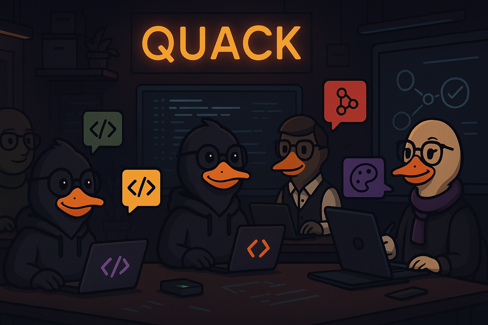
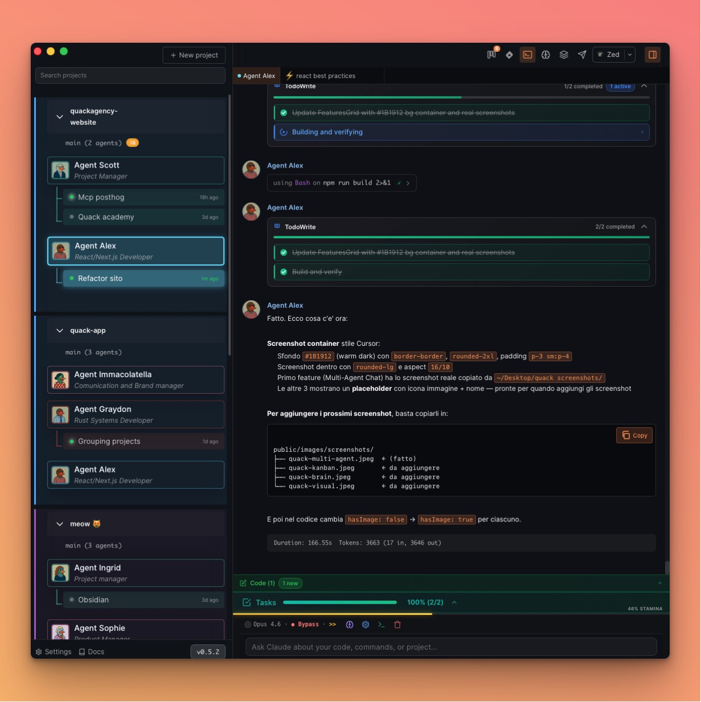
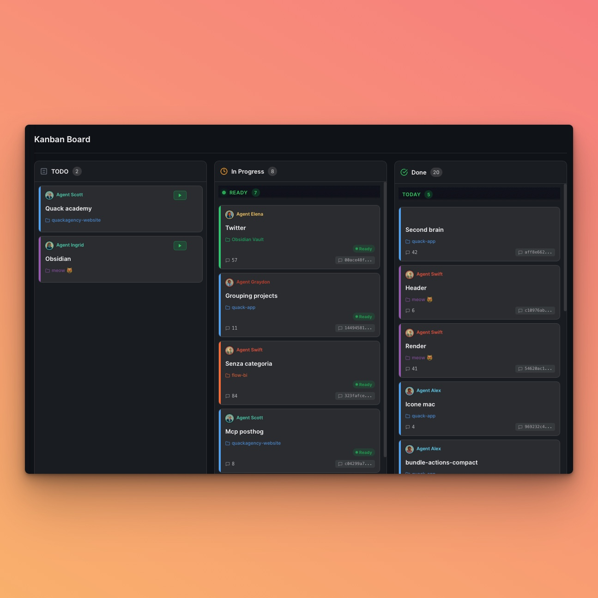
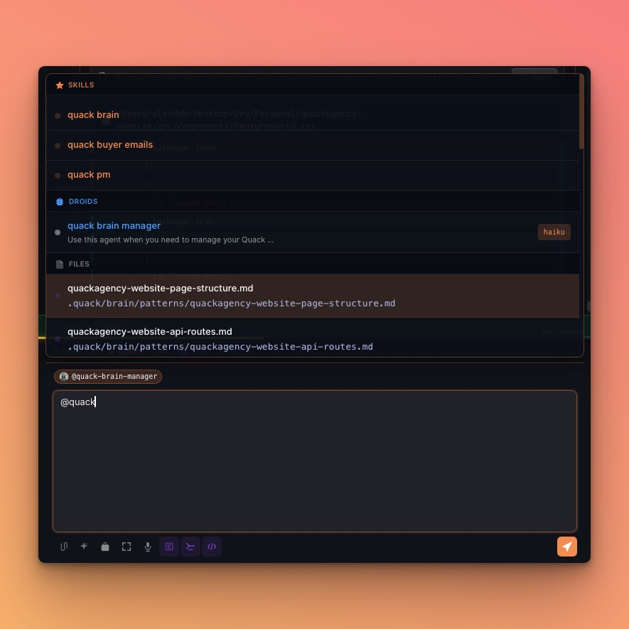
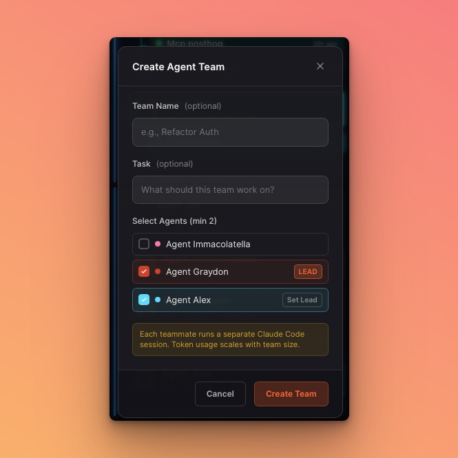

<div align="center">



<br>

# The Most Productive Way to Use Claude Code

**Work on multiple projects while Claude thinks. Never wait idle again.**

<br>

[](https://github.com/AlekDob/quack-releases/releases/latest)
[](https://github.com/AlekDob/quack-releases/releases)
[](https://github.com/AlekDob/quack-releases/stargazers)
[](https://github.com/AlekDob/quack-releases/releases/latest)
[](https://github.com/AlekDob/quack-releases/releases/latest)

<br>

[](https://github.com/AlekDob/quack-releases/releases/latest)
&nbsp;&nbsp;
[](https://discord.com/invite/bQd39uDhnc)
&nbsp;&nbsp;
[](https://quack.build)

<br>

<sup>Built on Claude Agent SDK &nbsp;·&nbsp; macOS & Windows &nbsp;·&nbsp; Early Access</sup>

</div>

<br>

## What is Quack?

Quack is a **native desktop app** that wraps Claude Code in a multi-project, multi-agent workspace. Instead of running one Claude session in a terminal, you run many — each with its own role, memory, and tools.

> **Think of it as an IDE for AI agents** — where you're the architect and Claude is the builder.

<br>

## Screenshots

<div align="center">

<table>
<tr>
<td width="50%">



<p align="center"><b>Multi-Agent Workspace</b><br><sub>Multiple projects, multiple agents, real-time sessions</sub></p>

</td>
<td width="50%">



<p align="center"><b>Kanban Board</b><br><sub>Visual task management with drag-and-drop</sub></p>

</td>
</tr>
<tr>
<td width="50%">



<p align="center"><b>Second Brain</b><br><sub>Skills, droids, and file-based knowledge</sub></p>

</td>
<td width="50%">



<p align="center"><b>Agent Teams</b><br><sub>Create teams with leads and parallel sessions</sub></p>

</td>
</tr>
</table>

</div>

<br>

## Features

<table>
<tr>
<td width="60">

```
🤖
```

</td>
<td>

**Multi-Agent System** — Create specialized AI agents with unique roles. A project manager, a frontend dev, a Rust expert — each running their own Claude Code session in parallel.

</td>
</tr>
<tr>
<td>

```
⌨️
```

</td>
<td>

**Integrated Terminals** — Full xterm.js terminal sessions with AI assistance built-in. Watch Claude think, execute commands, and iterate in real time.

</td>
</tr>
<tr>
<td>

```
📋
```

</td>
<td>

**Kanban Board** — Visual task management for AI workflows. Assign tasks to agents, track progress, and open with `Cmd+K`.

</td>
</tr>
<tr>
<td>

```
🧠
```

</td>
<td>

**Second Brain** — File-based knowledge store in `~/.quack/brain/`. Save patterns, gotchas, and decisions so your AI remembers across sessions and projects.

</td>
</tr>
<tr>
<td>

```
🔌
```

</td>
<td>

**MCP Integration** — Connect Gmail, GitHub, Twitter, Linear, and 50+ tools via the Model Context Protocol. Extend your agents with any capability.

</td>
</tr>
<tr>
<td>

```
⚡
```

</td>
<td>

**Background Tasks & Automations** — Non-blocking execution for long-running operations. Schedule cron jobs, run automations, and let agents work while you focus.

</td>
</tr>
</table>

<br>

## Why Quack?

| | Feature | Description |
|:---:|---------|-------------|
| 🔒 | **Privacy First** | Your code and conversations stay on your machine. No cloud storage. |
| 📂 | **Multi-Project** | Work on multiple codebases simultaneously with dedicated agents per project. |
| 🧩 | **Extensible** | Add any MCP server, create custom skills, build agent droids. |
| 🚀 | **Native Performance** | Built with Tauri 2 + Rust. Fast, lightweight, no Electron bloat. |
| 👥 | **Agent Teams** | Create teams of agents that collaborate on complex tasks. |
| 📱 | **Remote Access** | Monitor and control your agents from your phone via Quack Remote. |

<br>

## Download

### macOS (Universal Binary)

Works on **Apple Silicon** (M1/M2/M3/M4) and **Intel** Macs — macOS 10.15+

| Format | Architecture | |
|--------|-------------|---|
| `.dmg` | Universal (ARM64 + x86_64) | [**Download Latest**](https://github.com/AlekDob/quack-releases/releases/latest) |

### Windows

| Format | Architecture | |
|--------|-------------|---|
| `.exe` | x64 | [**Download Latest**](https://github.com/AlekDob/quack-releases/releases/latest) |

### Installation

1. Download the installer for your platform
2. **macOS**: Open `.dmg` and drag Quack to Applications
3. **Windows**: Run the `.exe` installer
4. **First launch (macOS)**: System Settings → Privacy & Security → "Open Anyway"

> Quack includes **automatic updates**. New versions are downloaded in the background and applied on next launch.

<br>

## Tech Stack

| Layer | Technology |
|-------|-----------|
| Framework | [Tauri 2.x](https://tauri.app) (Rust) |
| Frontend | React 19, TypeScript strict |
| AI Engine | [Claude Agent SDK](https://docs.anthropic.com/en/docs/agents-and-tools/claude-code/sdk) |
| Terminals | xterm.js |
| State | Zustand |
| Styling | Tailwind CSS |

<br>

## Community

<div align="center">

[](https://discord.com/invite/bQd39uDhnc)

</div>

- **Website**: [quack.build](https://quack.build)
- **Discord**: [Join our community](https://discord.com/invite/bQd39uDhnc) — feature requests, bug reports, and chat
- **Twitter/X**: [@AleQDobrik](https://x.com/AleQDobrik)
- **GitHub**: You're here! Star this repo to stay updated

<br>

---

<div align="center">

<sub>Built with 🦆 by <a href="https://alekdob.com">Alek</a> &nbsp;·&nbsp; Powered by Tauri + React + Claude Agent SDK</sub>

</div>
